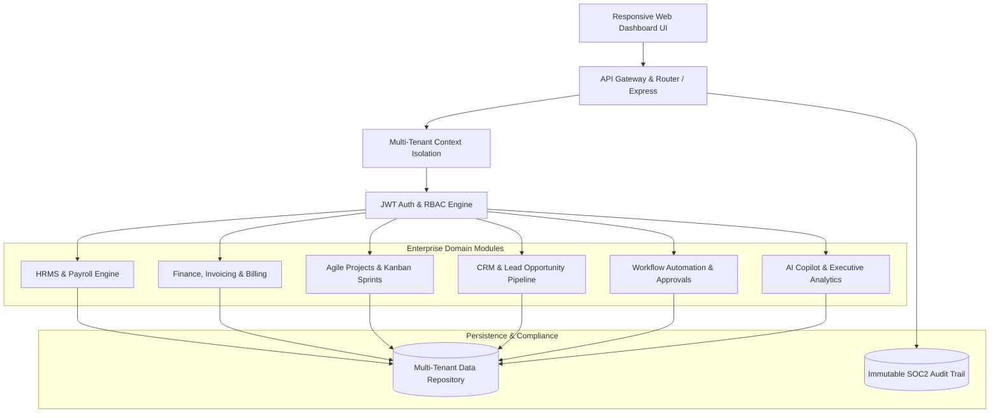

# 🌐 OmniFlow Enterprise Suite

> **Production-Grade Multi-Tenant Enterprise SaaS & Modular ERP Platform**  
> *Engineered for modern high-growth companies to unify HRMS, Finance, Project Workflows, CRM, Approvals, and AI-Powered Decision Intelligence.*

[](https://github.com/saiteja271/omniflow-enterprise-saas/actions)
[](https://opensource.org/licenses/MIT)
[](#security--governance)
[](#system-architecture)

---

## 🏛️ System Architecture



---

## 🌟 Core Enterprise Modules

### 1. 👥 Human Resource Management System (HRMS) & Payroll
- **Employee Directory**: Manage profiles, roles, departments, join dates, and compensation tiers.
- **Automated Payroll**: One-click monthly salary disbursement calculation with audit trail logging.
- **Department Hierarchies**: Budget allocation, head of department tracking, and performance scores.

### 2. 💳 Finance, Billing & Invoicing
- **Multi-Tenant Invoicing**: Auto-generate GAAP-compliant invoices with line items and automated tax calculations.
- **Accounts Receivable Tracking**: Real-time status lifecycles (`PENDING`, `PAID`, `OVERDUE`).
- **Revenue Ledgers**: Track booked revenue, pending receivables, and department budget utilization.

### 3. 📋 Agile Projects, Sprints & Kanban Board
- **Interactive Kanban**: Task workflow across `TODO`, `IN_PROGRESS`, `REVIEW`, and `DONE`.
- **Sprint Management**: Priority queues (`CRITICAL`, `HIGH`, `MEDIUM`, `LOW`), estimate hours vs. logged hours.
- **Cross-Department Initiatives**: Progress tracking and strategic milestones.

### 4. 📈 CRM & Enterprise Sales Pipeline
- **Deals Funnel**: Stage-based tracking (`QUALIFIED` ➔ `PROPOSAL_SENT` ➔ `NEGOTIATION` ➔ `CLOSED_WON`).
- **Weighted Lead Scoring**: Real-time pipeline valuation computed from closing probability metrics.
- **Account Intelligence**: Direct logging of enterprise RFPs, client contacts, and deal notes.

### 5. ⚡ Workflow Automation & Multi-Tier Approvals
- **State-Machine Workflow Engine**: Multi-level reviews for CapEx expenditures, PTO leave requests, and vendor contracts.
- **One-Click Actions**: Approve/Reject with reviewer identity attribution and resolution notes.
- **Urgency Dispatch**: High-urgency request alerts and automated status progression.

### 6. 🧠 AI Copilot & Executive Analytics
- **Contextual AI Insights**: Real-time inference analyzing pipeline velocity, cash flow alerts, and engineering sprint output.
- **KPI Command Center**: Consolidated real-time metrics for executive decision-makers.

### 7. 🔒 Security, RBAC & Audit Trail
- **Role-Based Access Control (RBAC)**: Fine-grained permissions (`SUPER_ADMIN`, `ORG_ADMIN`, `MANAGER`, `EMPLOYEE`, `AUDITOR`).
- **Tenant Data Isolation**: Header-driven and token-driven multi-tenant partitioning (`x-tenant-id`).
- **Immutable Audit Trail**: Timestamped logs capturing actor, action, resource, IP address, and payload diffs.

---

## 🚀 Quick Start Guide

### Prerequisites
- Node.js (v18 or higher recommended)

### 1. Launch OmniFlow Server
```bash
# Start the server (Zero external dependencies needed!)
npm start
```
The server will start on: **`http://localhost:3000`**

### 2. Run Automated Test Suite
```bash
npm test
```

---

## 🌿 Git 10-Branch Hierarchy & Pull Request Guide

This repository contains **10 structured branches** (8 dedicated feature branches + `develop` + `main`):

```
main (Production)
 └── develop (Staging / Integration)
      ├── feature/multi-tenant-rbac
      ├── feature/hrms-payroll-engine
      ├── feature/finance-billing-invoicing
      ├── feature/projects-agile-kanban
      ├── feature/crm-pipeline-funnel
      ├── feature/workflow-approval-engine
      ├── feature/ai-analytics-copilot
      └── feature/security-audit-logging
```

### ⚡ One-Click Automated Push (Windows / PowerShell)
Run the included PowerShell script to push all 10 branches to GitHub:

```powershell
powershell -ExecutionPolicy Bypass -File ./git-setup-and-push.ps1
```

*(Or simply double click `git-push.bat` on Windows, or run `./git-setup-and-push.sh` on Linux/macOS)*

### 🔗 Pull Requests to Open on GitHub

1. **Multi-Tenant & RBAC PR**:
   - **Base**: `develop` ⬅️ **Compare**: `feature/multi-tenant-rbac`
   - **URL**: [Create RBAC PR](https://github.com/saiteja271/omniflow-enterprise-saas/compare/develop...feature/multi-tenant-rbac)
2. **HRMS & Payroll Feature PR**:
   - **Base**: `develop` ⬅️ **Compare**: `feature/hrms-payroll-engine`
   - **URL**: [Create HRMS PR](https://github.com/saiteja271/omniflow-enterprise-saas/compare/develop...feature/hrms-payroll-engine)
3. **Finance & Invoicing Feature PR**:
   - **Base**: `develop` ⬅️ **Compare**: `feature/finance-billing-invoicing`
   - **URL**: [Create Finance PR](https://github.com/saiteja271/omniflow-enterprise-saas/compare/develop...feature/finance-billing-invoicing)
4. **Projects & Kanban Feature PR**:
   - **Base**: `develop` ⬅️ **Compare**: `feature/projects-agile-kanban`
   - **URL**: [Create Projects PR](https://github.com/saiteja271/omniflow-enterprise-saas/compare/develop...feature/projects-agile-kanban)
5. **CRM Pipeline Feature PR**:
   - **Base**: `develop` ⬅️ **Compare**: `feature/crm-pipeline-funnel`
   - **URL**: [Create CRM PR](https://github.com/saiteja271/omniflow-enterprise-saas/compare/develop...feature/crm-pipeline-funnel)
6. **Workflow Approvals Feature PR**:
   - **Base**: `develop` ⬅️ **Compare**: `feature/workflow-approval-engine`
   - **URL**: [Create Approvals PR](https://github.com/saiteja271/omniflow-enterprise-saas/compare/develop...feature/workflow-approval-engine)
7. **AI Analytics & Copilot PR**:
   - **Base**: `develop` ⬅️ **Compare**: `feature/ai-analytics-copilot`
   - **URL**: [Create AI Analytics PR](https://github.com/saiteja271/omniflow-enterprise-saas/compare/develop...feature/ai-analytics-copilot)
8. **Security & Audit Logging PR**:
   - **Base**: `develop` ⬅️ **Compare**: `feature/security-audit-logging`
   - **URL**: [Create Audit PR](https://github.com/saiteja271/omniflow-enterprise-saas/compare/develop...feature/security-audit-logging)
9. **Staging to Production Release PR**:
   - **Base**: `main` ⬅️ **Compare**: `develop`
   - **URL**: [Create Release PR](https://github.com/saiteja271/omniflow-enterprise-saas/compare/main...develop)

---

## 📄 License
Released under the [MIT License](LICENSE). Built for enterprise scalability.
